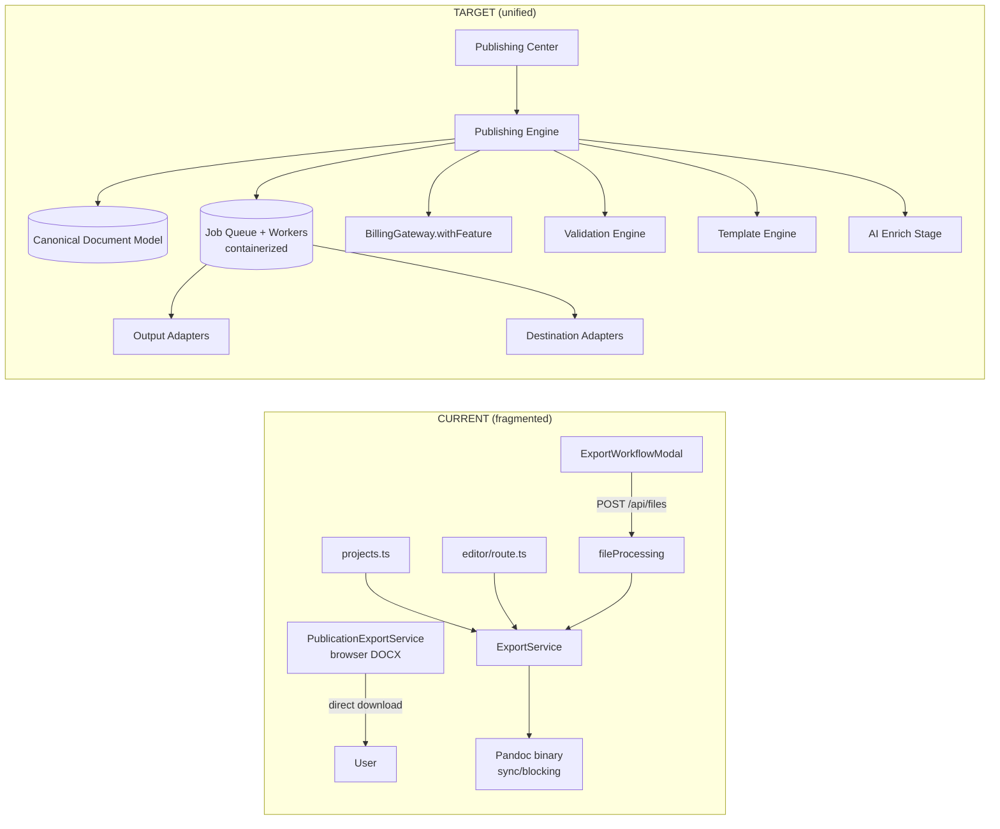
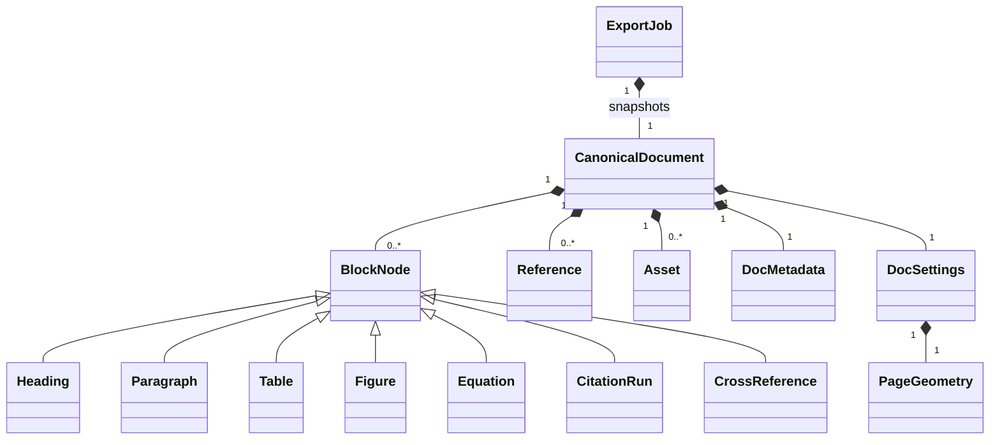
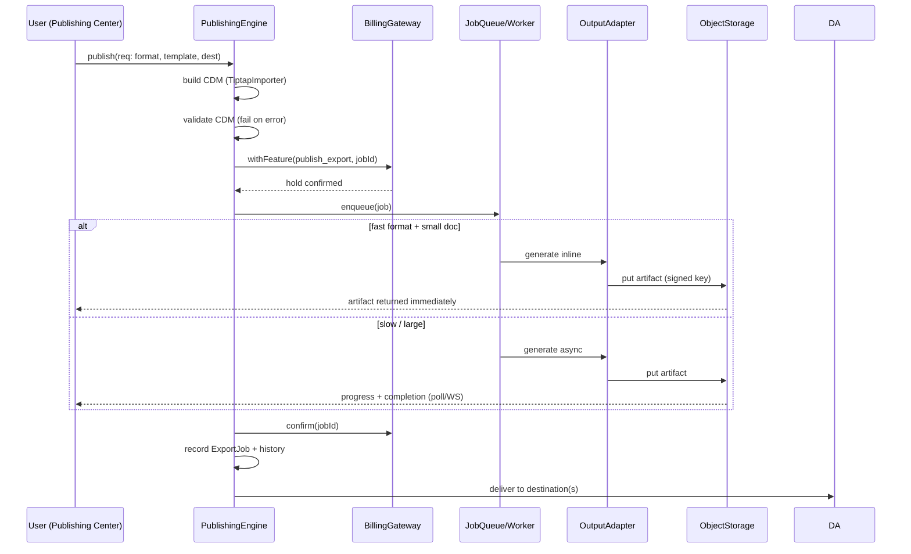
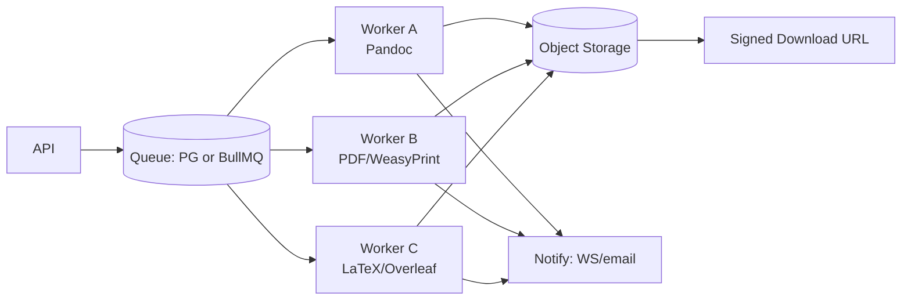
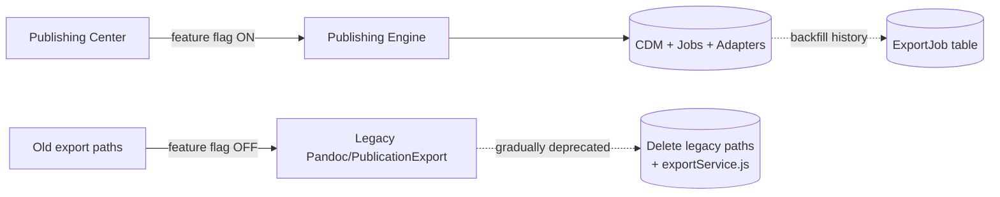
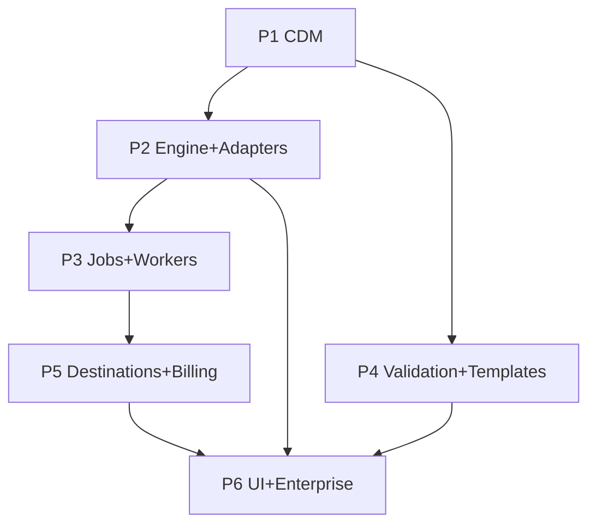

# ColabWize Document Publishing Platform — Architecture Review & Implementation Plan

**Status:** Draft for review (P0 — Major Platform Redesign)
**Author:** Architecture analysis against `docs/export workflow.md` (V4 Engineering Review)
**Scope:** Replace the fragmented Export system with a first-class, adapter-based Publishing Platform.
**This document is a planning deliverable only. No application code has been written.**

---

## 0. How to read this document

- **§1 Executive summary** — the one-page decision brief.
- **§2 Current-state evidence** — what actually exists today, with `file:line` citations (verified by direct code reading; the parallel exploration agents were unavailable due to upstream credit limits, so all findings below are from first-hand inspection).
- **§3 Gap analysis** — every architectural gap, tech-debt item, scalability risk, and UX limitation, mapped to the spec.
- **§4 Challenged assumptions** — where the V4 spec can be improved, with justifications.
- **§5 Target architecture** — Canonical Document Model, Publishing Engine, adapters, job system, templates, validation, billing, cloud, AI, ops, UI/UX, enterprise.
- **§6 Diagrams** — context, component, data-flow, sequence, CDM model, queue, migration (Mermaid).
- **§7 Migration path** — strangler-fig rollout, dual-run, backfill, rollback.
- **§8 Implementation roadmap** — 6 phases with priority, dependencies, complexity, effort, risks.
- **§9 Testing / observability / security / rollback** — cross-cutting.
- **§10 Open questions for reviewers.**

---

## 1. Executive Summary

The current "Export" capability is **not one system — it is at least five divergent code paths** that produce different output fidelity from different data sources:

1. `POST /api/files` → `fileProcessing.ts` → `ExportService` → **Pandoc binary** (PDF/DOCX only; LaTeX/RTF/TXT error out).
2. `backend/src/api/projects/projects.ts` → `ExportService.exportProject` (a second, parallel backend entry).
3. `backend/src/api/editor/route.ts` `fileData` handling (a third entry, import/export hybrid).
4. `backend/src/hybrid/serverless/file-processing.ts` (a serverless copy of #1).
5. **Frontend `PublicationExportService` (1,654 lines)** hand-rolls TipTap→DOCX in the browser, plus `HtmlExportService` builds styled HTML — a sixth path that bypasses the backend entirely.

None of these share a canonical intermediate model. The de-facto model is "whatever HTML the browser emits" (`prepareFinalHtml`), or ad-hoc TipTap→HTML via StarterKit only (which **drops citations, bibliography, figures, and custom nodes**). There is **no job system, no version history, no output storage, no signed download URL, no centralized validation, and no real template/formatting engine**. Billing is embedded ad-hoc (PDF charges free users 1 credit; DOCX is free; paid users unlimited) and **bypasses the mature `BillingGateway.withFeature` transactional wrapper** that already exists in the codebase.

**Recommendation:** Build a new **Publishing Platform** as a separate, well-bounded service behind a feature flag, using the *Strangler Fig* pattern so the old paths keep working until each is cut over. Reuse what already exists and is good: the `BillingGateway` (hold/confirm/release), the CSL/citeproc engine (`citationEngine.ts`/`cslNormalization.ts`), the partial storage-provider abstraction (`GoogleDriveProvider`, `OneDriveProvider`), and the Prisma scaffolding (`DocumentTemplate`, `DocumentVersion`, `PdfDocument`, `UsageEvent`). Introduce a **semantic Canonical Document Model (CDM)** (not HTML), an **adapter layer** for both output formats and destinations, and a **background job system** — but make job execution *adaptive* (synchronous-fast for small docs, async for large/slow) rather than universally asynchronous.

Total estimated engineering effort: **~14–18 engineer-weeks** across 6 phases (see §8).

---

## 2. Current-State Evidence (verified)

### 2.1 Frontend export surface
| File | Role | Key observations |
|---|---|---|
| `src/components/export/ExportWorkflowModal.tsx` | 4-step wizard (45 KB) | `prepareFinalHtml` (L224) regex-flattens citation/bibliography `<a>`/`<div>` nodes into inline HTML. `handleDownload` (L276) sends `{ content: TipTap JSON, htmlContent, metadata }` to `POST /api/files` (L340) and triggers a raw browser download. Calls `CitationOrchestrator.runExport` (L314) as a per-process in-memory lock. |
| `src/components/export/ExportFormatModal.tsx` | Standalone format picker | Calls `OriginalityService.checkSelfPlagiarism` (L45, L137); warns if internal similarity >20%. Supports docx/latex/rtf/txt (placeholders for some). |
| `src/components/export/ActionChecklistModal.tsx` | Pre-submission checklist | **Hardcoded** checkbox list ("Add citations to highlights", …). Not data-driven; not a validation engine. |
| `src/services/CitationOrchestrator.ts` | "Lock" service | In-memory `Map` of per-project locks; 10 s auto-release (L31). **Not safe across multiple server instances** (no shared store). |
| `src/services/publicationExportService.ts` | **Client-side DOCX generator** (1,654 lines) | Converts TipTap→DOCX in the browser with hand-rolled paragraph/style logic. A complete parallel pipeline to the backend. |
| `src/services/htmlExportService.ts` | Client HTML builder (609 lines) | TipTap→HTML with **hardcoded `apa/mla/chicago`** styles; builds abstract/cover/references markup. |
| `src/services/exportService.js` | **Legacy** (611 lines, `.js`) | Talks to `http://localhost:3001` directly; `console.log` debug noise; contains the only vestigial "Overleaf" references. Should be deleted. |
| `src/services/originalityService.ts` | Self-plagiarism client | `checkSelfPlagiarism` (L265) → `POST /api/originality/check-self-plagiarism`. Compares against internal corpus only. |

### 2.2 Backend export surface
| File | Role | Key observations |
|---|---|---|
| `backend/src/api/files/fileProcessing.ts` | `POST /api/files` handler | Delegates to serverless `fileProcessing`. Only `export-pdf`/`export-docx` handled (L28–31); otherwise `Unsupported file type`. |
| `backend/src/hybrid/serverless/file-processing.ts` | Core handler | `handleDirectExport` (L106): **embeds billing** (free-user 1-credit reserve for PDF only, L115–129), calls `ExportService.exportProject`, streams the buffer straight back (L149). No storage, no history, no checksum. `runtime: nodejs18.x` (L164). |
| `backend/src/services/exportService.ts` | Export orchestration | `exportProject` (L24) takes `htmlContent` (or falls back to StarterKit-only TipTap→HTML, L49–63 — **loses custom nodes**), then calls Pandoc. **`citationStyle`/`journalTemplate` options are accepted but ignored** (passed to Pandoc which doesn't apply CSL). |
| `backend/src/services/pandocExportService.ts` | **Pandoc shell-out** | `exec` of a **Pandoc binary** (L64), `getPandocPath` resolves env → `bin/bin/pandoc` → system `pandoc` (L11). PDF command (L58–60) does **not** pass `--csl`/bibliography → citation style NOT enforced. Returns in-memory `Buffer`. Temp dir cleaned in `finally`. |
| `backend/src/api/projects/projects.ts` | **Second** export entry | `exportProject` called at L109 and L155 for docx/pdf. Independent of the `/api/files` path. |
| `backend/src/api/editor/route.ts` | **Third** entry | `fileData` import/export handling at L679–722. |
| `backend/src/api/files/upload.ts` | Generic file upload | This is the *import/attachment* endpoint (multer, Supabase storage). **Not** the export converter, despite the shared `/api/files` prefix — a naming collision that harms clarity. |
| `backend/src/workers/pdfWorker.ts` | Worker thread | Parses *imported* PDFs (`pdf-parse`). Not an export worker. Useful as a pattern seed. |
| `backend/src/jobs/*` | Scheduled jobs | `imageRetentionJob`, `searchAlertJobs`, `subscriptionJobs` — cron-style, no general queue. |

### 2.3 Billing, citations, templates, cloud (verified)
| File | Finding |
|---|---|
| `backend/src/billing/BillingGateway.ts` | **Mature, correct.** `hold`/`confirm`/`release`/`withFeature` (L44–462) with idempotency via `referenceId`, transactional entitlement decrement, credit fallback, refund-on-release. `mapFeatureKey` (L464) maps feature→entitlement. The export path should route through `withFeature`, not ad-hoc `CreditService`. |
| `backend/src/services/citationEngine.ts`, `cslNormalization.ts`, `citeproc.d.ts` | A **CSL/citeproc capability already exists** in the backend but is **disconnected from export**. Reuse it inside the engine. |
| `backend/prisma/schema.prisma` → `DocumentTemplate` (L1221) | Content-scaffold template only (`content: Json` TipTap starter, `citation_style`). **No** typography/margins/heading-style/page-numbering model. The spec's "Template System" (APA/IEEE/Nature/Elsevier formatting) does **not** exist. |
| `backend/src/services/storage/GoogleDriveProvider.ts`, `OneDriveProvider.ts` | A **partial destination-adapter seed** exists on the backend. `zoteroService`, `mendeleyService`, `googleDriveService`, `onedriveService` are **hand-rolled per provider** (frontend + backend), no shared `DestinationAdapter` interface. Zotero/Mendeley are metadata-only (product decision). **Overleaf: not implemented** (only legacy mentions). |
| `backend/prisma/schema.prisma` | Models present: `PdfDocument`, `DocumentVersion`, `AuditJob`/`AuditReport`, `CreditBalance`/`CreditTransaction`, `UsageEvent` (L1197), `UserEntitlement` (L1341). **No `ExportJob` model.** No `PublishingHistory`/`ExportJob` table. |
| `backend/check-limits.ts` | One-off script exercising `BillingGateway.withFeature`. Confirms the gateway works. Not part of the app. |

---

## 3. Gap Analysis

### 3.1 Architectural gaps
| # | Gap | Evidence | Spec requirement |
|---|---|---|---|
| G1 | **Multiple divergent export paths** (5+ entry points, 2 pipelines with different fidelity) | §2.1–2.2 | "Single publishing pipeline" |
| G2 | **No Canonical Document Model** — de-facto model is browser HTML; backend fallback is StarterKit-only TipTap→HTML that **drops citations/bibliography/figures/custom nodes** | `exportService.ts` L49–63, `prepareFinalHtml` | "Canonical Document Model" |
| G3 | **Format-coupled, binary-dependent engine** — Pandoc shell-out is synchronous, blocking, and serverless-incompatible (`nodejs18.x` + no binary in Lambda) | `pandocExportService.ts` L11/64; `serverless/file-processing.ts` L164 | "Operations review / container compatibility" |
| G4 | **No background job system** — generation blocks the HTTP request; no retries/cancel/progress/notify | entire sync path | "Export Job System" |
| G5 | **No versioned publishing history** — output streamed to client, never persisted; no checksum/size/duration/link | `fileProcessing.ts` L149 | "Version History", "Publishing Timeline" |
| G6 | **Billing bypasses the gateway** — ad-hoc `CreditService.reserveCredits` for PDF-free-users only; DOCX free; paid unlimited; no idempotency/refund on the export path | `serverless/file-processing.ts` L115–129 | "Unified billing integration" |
| G7 | **No template / formatting engine** — `DocumentTemplate` is a content scaffold; citation style not applied at engine level (Pandoc gets no `--csl`) | `DocumentTemplate` L1221; `pandocExportService.ts` L58–60 | "Template System" |
| G8 | **No centralized validation engine** — `ActionChecklistModal` is a hardcoded checkbox list; no missing-ref / broken-citation / figure-numbering checks | `ActionChecklistModal.tsx`, `ExportFormatModal.tsx` | "Pre-Publish Validation" |
| G9 | **Cloud integrations are hand-rolled, no `DestinationAdapter`** — Overleaf absent; Zotero/Mendeley metadata-only; Google Drive/OneDrive have backend providers but no uniform interface | §2.3 | "Publishing Destinations / Cloud Integrations" |
| G10 | **No observability on export** — no metrics/tracing per job; failures only logged | all export paths | "Operations Review / Observability" |
| G11 | **No AI-publishing stage** — originality check exists but is separate and not a pipeline stage | `originalityService.ts` | "AI Integration" |

### 3.2 Technical debt
- **T1** Legacy `src/services/exportService.js` (localhost:3001, `.js`, debug noise) — delete.
- **T2** `CitationOrchestrator` in-memory lock is unsafe under horizontal scaling — replace with shared lock or remove (CDM + job idempotency makes it unnecessary).
- **T3** Naming collision: `/api/files` means both "import attachment upload" and "export conversion" — split into `/api/publishing`.
- **T4** `prepareFinalHtml` regex hacks over serialized HTML are fragile (a CDM removes the need entirely).
- **T5** `PandocExportService` ignores `citationStyle`/`citations` options (dead params) — misleading API.
- **T6** Three backend export entries (`fileProcessing`, `projects.ts`, `editor/route.ts`) duplicate logic.

### 3.3 Scalability / performance risks
- **S1** Blocking Pandoc on the request thread caps concurrency to worker count; a 500–1000-page PDF can exhaust memory and stall the instance.
- **S2** In-memory `Buffer` return for large docs increases peak RSS and can't stream.
- **S3** No parallelism / no format-isolation; one slow PDF blocks the only handler.
- **S4** Per-project in-memory lock (T2) becomes a correctness bug (not just perf) under multiple instances.
- **S5** No temp-object storage strategy; temp files on local disk don't survive in ephemeral/serverless environments.

### 3.4 Security / compliance
- **C1** OAuth tokens for Google Drive/OneDrive/Zotero/Mendeley stored in `users` table columns (`zotero_api_key`, `google_access_token`, …) — must be encrypted at rest / moved to a secrets store; rotate refresh tokens.
- **C2** Output streamed with `Content-Disposition: attachment` but **no signed URL, no expiry, no access-control re-check after generation** — a generated document could be re-fetched if the link leaks; gate downloads behind auth + short-lived signed URL.
- **C3** No virus scanning / sensitivity handling for documents pushed to external clouds.
- **C4** `prepareFinalHtml` injects user HTML into the export with no DOMPurify pass on the server side (frontend sanitizes editor input, but the export path trusts it).

### 3.5 UX limitations
- **U1** "Export" mental model, not "Publish/Submit/Archive" — the spec's core product shift is unmet.
- **U2** No Publishing Center; modals are disconnected and format-centric.
- **U3** No progress/status for long generations (request just hangs).
- **U4** No history/timeline; re-exporting means re-running the whole wizard.
- **U5** Self-plagiarism guard exists only in `ExportFormatModal`, not the main wizard.
- **U6** Validation is a manual checklist, not actionable, auto-detected issues.
- **U7** No templates/favorites/presets; every export re-enters metadata.

---

## 4. Challenged Assumptions (improvements to the V4 spec)

The spec is strong, but several directives are over-absolute or mis-targeted. Where I disagree, I propose a better alternative with reasoning.

**A. "Hard Pandoc dependency" is framed as the problem — it isn't.**
Pandoc is the best universal document trans-coder available and should be **kept** for DOCX/LaTeX/RTF/EPUB. The real problems are (1) running a *binary* inside a *serverless* function (no binary, no local disk), and (2) using lossy **HTML** as the interchange format. Fix by **moving generation into containerized workers** (Docker/Render/Railway) and feeding Pandoc from the **CDM serialized to Pandoc's JSON AST** (or Typst/LaTeX), not re-parsed HTML. For **PDF specifically**, adopt a serverless-friendly engine (WeasyPrint for HTML→PDF, or Typst for high fidelity) so the common case stays fast and Lambda-compatible.

**B. "Every exporter should consume the same intermediate document" — agree, but HTML is the wrong intermediate.**
The CDM must be a **semantic JSON model** (nodes: heading/paragraph/figure/citation/reference/equation/crossref), not HTML. HTML is lossy (loses semantics, ordering intent, styling intent) and is exactly why citations/bibliography get mangled by regex today. Adapters serialize the CDM to the format-appropriate interchange (Pandoc AST for docx/latex, HTML+CSS for PDF/WeasyPrint, HTML for Google Docs, LaTeX for Overleaf). *One model, many serializations.*

**C. "Do not generate documents synchronously" is too absolute.**
For the common case (10–100 pages, DOCX/HTML), synchronous generation is better UX (instant download, no polling). Recommendation: **adaptive execution** — always create an `ExportJob` record (for history/observability/idempotency), but if the format is "fast" and the document is small, generate inline and return immediately; otherwise enqueue and return a job handle the UI polls/streams. This avoids over-engineering latency into the 90% case while still satisfying "every export is an observable job."

**D. "Journal templates: Nature, Elsevier, Springer, IEEE, ACM, CVPR, NeurIPS, ICML" should not be N bespoke engines.**
Most journal requirements reduce to: a **CSL style** + **page geometry** (margins, columns) + **heading/reference styling** + optional **template variables** (logo, abstract width). Build **one `Template` entity** = `{ cslStyle, pageGeometry, headingStyles, referenceFormat, templateVariables, targetProfiles[] }` resolved by adapters. Skip bespoke typography code per journal; contribute/borrow Pandoc/LaTeX journal templates where they exist. This is 10× less work and far more maintainable.

**E. "AI Publishing Assistant" as a separate Phase 6 is the wrong shape.**
AI should be an **optional pipeline stage** (`enrich`), not a bolt-on phase: e.g., submission-readiness scoring, reference-health, journal recommendation, accessibility review. Putting it in the pipeline means it benefits from the same job/validation/observability machinery. Phase 6 becomes "enable AI stage + UI affordances" rather than a new subsystem. **(Update: the `enrich` stage was ultimately removed entirely — no AI enrichment in ColabWize's publishing flow. See Phase 6.)**

**F. "Canonical model → every format" for EPUB/Kindle/Google Docs/Overleaf.**
Acceptable with adapters, but note: Overleaf should receive **LaTeX** (CDM→LaTeX adapter), Google Docs via **Docs API from CDM→HTML**, Kindle via **EPUB→KPF**. No format needs a from-scratch writer if we reuse Pandoc + WeasyPrint + Typst as the engine substrate.

---

## 5. Target Architecture

### 5.1 Canonical Document Model (CDM)
A versioned, semantic JSON document — **the single source of truth** every adapter reads.

```
CanonicalDocument {
  schemaVersion: "1.0"
  metadata: { title, authors[], affiliations[], abstract, keywords[],
              runningHead, date, course?, instructor?, doi?, license? }
  settings: { locale, direction, cslStyle, templateId?,
              pageGeometry: { size, margin, columns },
              numbering: { figures, tables, equations, headings } }
  body: BlockNode[]            // ordered semantic tree
  references: Reference[]      // resolved bibliography entries (CSL-JSON)
  assets: Asset[]              // figures/images with content-hash + storage ref
  annotations?: ValidationFinding[]   // problems detected during build
}
BlockNode (discriminated union):
  Heading | Paragraph | List | BlockQuote | Table | Figure |
  Equation | CrossReference | CitationRun | PageBreak | Appendix
Reference { id, cslJson, raw? }
Asset { id, sha256, mime, storageKey, width?, caption? }
```

- TipTap JSON → CDM is a **one-way importer** (`TiptapImporter`); CDM → TipTap is a **round-trip exporter** (so the editor and the model stay in sync for re-import).
- CDM is stored as `Json` on the `DocumentVersion` and referenced by `ExportJob`.
- CDM replaces `prepareFinalHtml` entirely (no regex over HTML).

### 5.2 Publishing Engine
A single service (`backend/src/publishing/`) with one public entry: `PublishingEngine.publish(request): JobHandle`.

Responsibilities: **build CDM → run validation → (optional) AI enrich → select adapters → generate → persist → deliver → record history → commit billing**. It orchestrates but contains **no format or destination logic** (those live in adapters). It calls `BillingGateway.withFeature(userId, 'publish_export', {referenceId: jobId, wordCount}, () => generate())` so billing is atomic with generation and idempotent per `jobId`.

### 5.3 Adapter architecture
Two orthogonal adapter families, each behind one interface, each independently testable.

**Output adapters** (`backend/src/publishing/adapters/output/`):
```ts
interface OutputAdapter {
  format: OutputFormat;               // 'pdf'|'docx'|'latex'|'html'|'rtf'|'md'|'epub'|'txt'
  estimateComplexity(doc): 'fast'|'slow';
  generate(doc: CanonicalDocument, ctx: GenCtx): Promise<GenResult>; // { storageKey, size, checksum, preview? }
}
```
Implementations: `PandocOutputAdapter` (docx/latex/rtf/epub via Pandoc AST, applies CSL), `WeasyPrintPdfAdapter` / `TypstPdfAdapter` (PDF), `HtmlOutputAdapter`, `MarkdownOutputAdapter`, `PlainTextAdapter`. Each serializes CDM→its interchange.

**Destination adapters** (`backend/src/publishing/adapters/destination/`):
```ts
interface DestinationAdapter {
  id: DestinationId;                 // 'local'|'google-drive'|'onedrive'|'dropbox'|'box'|'overleaf'|'github'|'zenodo'
  deliver(job: ExportJob, artifact: Artifact, creds): Promise<DeliveryResult>;
}
```
Reuses the existing `GoogleDriveProvider`/`OneDriveProvider` as the seed; adds `DropboxAdapter`, `BoxAdapter`, `OverleafAdapter` (LaTeX→Overleaf API), `GithubAdapter`, `ZenodoAdapter`. Credentials resolved from an encrypted token store (see C1).

### 5.4 Export Job System (queue)
- New `ExportJob` Prisma model (status: `PENDING|RUNNING|SUCCEEDED|FAILED|CANCELLED`, progress 0–100, retryCount, checksum, storageKey, sizeBytes, durationMs, templateId, format, cslStyle, error).
- Queue substrate: start with **DB-backed queue + worker pool** (zero new infra, reuses Postgres, survives serverless). Upgrade path to **BullMQ + Redis** when throughput demands it (interface unchanged). Workers are **containerized** (not `nodejs18.x` serverless) so Pandoc/Typst binaries and local temp storage exist.
- Engine returns a `JobHandle` immediately; for `fast` formats on small docs, the worker completes near-instantly and the UI gets the artifact inline; for `slow`/large, UI polls `GET /api/publishing/jobs/:id` or subscribes via WebSocket for progress + completion.
- Retries with exponential backoff; cancellation; failure → `release` billing hold; notifications via existing notification system.

### 5.5 Template Engine
New `PublishingTemplate` model: `{ id, name, family: 'apa'|'ieee'|'nature'|'elsevier'|'springer'|'acm'|'cvpr'|'neurips'|'icml'|'mla'|'chicago', cslStyle, pageGeometry, headingStyles, referenceFormat, templateVariables, targetProfiles[], isSystem, workspaceId? }`. Resolved by output adapters at generation time. Migrate existing `DocumentTemplate` content scaffolds to a separate "starter content" concept; keep them as optional initial-content presets, distinct from formatting templates.

### 5.6 Validation Engine
`backend/src/publishing/validation/` — a pipeline of rule checks over the CDM, each producing `ValidationFinding { severity: 'error'|'warning', code, message, locator }`:
missing-reference, broken-citation, duplicate-reference, missing-figure, broken-figure-numbering, missing-caption, broken-table, equation-numbering, heading-hierarchy, citation-style-compliance, asset-missing. Engine **fails** on `error`-severity (blocks generate, surfaces locators in UI) and **warns** on `warning`-severity (user acknowledges). Replaces `ActionChecklistModal` with a live, data-driven panel. Reuses the existing citation-audit/origininality services where applicable.

### 5.7 Billing integration
Route **all** publish attempts through `BillingGateway.withFeature(userId, 'publish_export', { referenceId: jobId, wordCount }, generate)`. Add `'publish_export'` to `mapFeatureKey` and plan limits. This gives idempotency (retries/double-clicks safe), plan-quota + credit fallback, and refund-on-failure for free — fixing G6 with **zero new billing code**.

### 5.8 Cloud integration
Uniform `DestinationAdapter` interface (§5.3). OAuth tokens moved to an encrypted secrets store (C1); refresh-token rotation. Future providers = one new adapter file. Overleaf implemented as LaTeX→Overleaf (no from-scratch writer).

### 5.9 AI publishing stage
An optional `enrich` stage in the engine: submission-readiness, reference-health, journal recommendation, accessibility/language review. Implemented as a pluggable stage so it inherits job/validation/observability. Gated by entitlement (reuse billing feature key e.g. `ai_publish`).

### 5.10 Performance & ops
- Workers containerized; Pandoc/Typst as pinned base images.
- Stream artifacts to object storage (Supabase/S3); never hold full doc in request memory (fixes S1–S3).
- Temp files on mounted/ephemeral volume with TTL cleanup (reuse existing startup cleanup in `main-server.ts`).
- Observability: every job emits metrics (duration, size, format, status) + tracing span; structured logs; failure alerts. (Fixes G10.)
- Health checks per worker; queue depth dashboard.

### 5.11 UI/UX — Publishing Center
Replace the three modals with a single **Publishing Center** route (`/publish/:projectId`) with sections: Destinations (Academic/Office/Cloud/Developer/Archive), Templates, Citation Style, Figures/Tables, Preview, Validation, Generate, **History/Timeline**, Saved Presets, Favorites, Publishing Analytics. The "Export" button becomes "Publish". Reuses existing Radix/Tailwind design system; Zustand for local state.

### 5.12 Enterprise readiness
- **Shared Templates** + **Org Branding** via `workspaceId` on `PublishingTemplate`.
- **Approval Workflows** as a pre-delivery stage (job waits in `PENDING_APPROVAL`).
- **Publication Policies** as validation rulesets bound to workspace/plan.
- **Submission Pipelines** = destination + template + policy bundles.

---

## 6. Diagrams (Mermaid)

### 6.1 Context / current vs target


### 6.2 Component relationships (target)
```mermaid
flowchart TD
  PC[Publishing Center UI] --> API[/api/publishing/*]
  API --> ENG[PublishingEngine]
  ENG --> IMP[TiptapImporter -> CDM]
  ENG --> VAL[ValidationEngine]
  ENG --> ENR[AIEnrichStage]
  ENG --> BILL[BillingGateway]
  ENG --> Q[JobQueue]
  Q --> W[WorkerPool]
  W --> OA1[PandocAdapter]
  W --> OA2[WeasyPrint/Typst PDF]
  W --> OA3[Html/Md/Text Adapter]
  W --> ST[(Object Storage)]
  W --> DA[DestinationAdapters]
  DA --> GDrive[Google Drive]
  DA --> One[OneDrive]
  DA --> Ov[Overleaf]
  DA --> Zen[Zenodo]
  ENG --> HIST[(ExportJob / PublishingHistory)]
```

### 6.3 CDM data model


### 6.4 Publish sequence (adaptive)


### 6.5 Queue / worker topology


### 6.6 Migration (strangler fig)


---

## 7. Migration Path

**Strategy: Strangler Fig + feature flag.** No big-bang cutover.

1. **Build in parallel.** New `backend/src/publishing/*` and `/api/publishing/*` coexist with legacy. Legacy paths unchanged.
2. **Flag the UI.** `PUBLISHING_CENTER_ENABLED` (per-user/per-workspace). When off, old modals remain. When on, "Publish" opens the Publishing Center; it calls only `/api/publishing/*`.
3. **Adapter-first, engine-second.** Ship OutputAdapters + CDM importer behind the engine; validate output parity against legacy Pandoc for PDF/DOCX on a golden set of documents (regression corpus).
4. **Dual-run (shadow).** For a period, run legacy and new engine side-by-side for opted-in users; compare checksums/size; alert on divergence. No user-facing change.
5. **Cut over per format/destination.** Enable new path for PDF, then DOCX, then LaTeX/RTF/MD/HTML/EPUB, then each cloud destination, each behind its own flag.
6. **Backfill history.** `ExportJob` table starts empty; populate going forward. Optionally import `PdfDocument` rows as historical "published" entries (best-effort).
7. **Decommission.** Delete `src/services/exportService.js`, `PublicationExportService` client DOCX path (once parity proven), `prepareFinalHtml`, the `/api/files` export branch, and the redundant `projects.ts`/`editor/route.ts` export handlers. Keep `/api/files` strictly for attachment upload (rename to `/api/attachments` to kill the naming collision T3).

**Rollback:** each flag flips independently; if a format/destination misbehaves, disable that flag and legacy path resumes. DB migrations are additive (new tables/models) so rollback never requires a destructive migration.

---

## 8. Implementation Roadmap

Complexity: **S** (≤1 wk) / **M** (1–3 wk) / **L** (3–6 wk) per workstream for **one engineer**; phases run with some parallelism. Effort totals assume 1–2 engineers.

### Phase 1 — Canonical Document Model + Importer  (Priority P0, Deps: none, Complexity: **M**, ~2 wk)
- Define CDM TypeScript types + Zod schema; `TiptapImporter` (TipTap JSON → CDM); `CdmExporter` (CDM → TipTap, for round-trip).
- Add `DocumentVersion.cdm Json?` column (additive migration).
- Unit tests on a golden corpus; parity checker vs current StarterKit output.
- **Risk:** TipTap node coverage (tables/figures/equations/crossrefs). **Mitigation:** explicit node matrix + fallback "unsupported node" finding.

### Phase 2 — Publishing Engine + Output Adapters  (P0, Deps: P1, Complexity: **L**, ~4 wk)
- `PublishingEngine`, `OutputAdapter` interface, `PandocOutputAdapter` (docx/latex/rtf/epub + CSL), `WeasyPrint/Typst PdfAdapter`, `Html/Markdown/TextAdapter`.
- Replace `prepareFinalHtml` (deleted). Generate from CDM, not HTML.
- **Risk:** PDF fidelity vs legacy. **Mitigation:** regression corpus + visual diff.

### Phase 3 — Export Job System + Workers  (P0, Deps: P2, Complexity: **L**, ~3 wk)
- `ExportJob` model; DB-backed queue → worker pool (containerized); `GET /api/publishing/jobs/:id` + WS progress; retries/cancel; artifact → object storage + signed URL; notifications.
- **Risk:** new infra (Redis) if BullMQ chosen. **Mitigation:** start PG-backed (zero infra); BullMQ later behind same interface.

### Phase 4 — Validation + Template Engines  (P1, Deps: P1, Complexity: **M**, ~3 wk)
- `ValidationEngine` rules over CDM (fail vs warn); `PublishingTemplate` model + resolver; migrate CSL styles in; replace `ActionChecklistModal` with live panel.
- **Risk:** journal template fidelity. **Mitigation:** template = CSL + geometry + variables (see §4.D), not bespoke engines.

### Phase 5 — Destination Adapters + Cloud + Billing  (P1, Deps: P3, Complexity: **L**, ~3 wk)
- `DestinationAdapter` interface; wrap `GoogleDriveProvider`/`OneDriveProvider`; add Dropbox/Box/Overleaf/GitHub/Zenodo; encrypted token store (C1); route all publish through `BillingGateway.withFeature` (`publish_export`); delete ad-hoc `CreditService` export billing.
- **Risk:** OAuth token security (C1). **Mitigation:** encrypt-at-rest + rotation before enabling cloud destinations.

### Phase 6 — Publishing Center UI + Enterprise  (P1, Deps: P2–P5, Complexity: **L**, ~3 wk)
- Publishing Center route (Templates/Style/Validation/History); workspace templates/branding/approval/policy. **AI `enrich` stage was explicitly removed — ColabWize is not doing AI enrichment here (decision: drop the `enrich` pipeline stage + its backend module entirely).**
- **Risk:** UI scope creep. **Mitigation:** ship read-only History + Validate + Templates first; Analytics/Enterprise as follow-ups behind flags.

**Total: ~18 engineer-weeks (1 engineer) / ~10 weeks (2 engineers).** Phases 1–3 are the critical P0 spine; 4–6 can begin partially in parallel once P2 lands.

### Dependency graph


---

## 9. Cross-Cutting

- **Testing:** golden corpus of documents (10/100/500/1000 pages, with figures/tables/equations/citations) for parity; adapter unit tests; engine integration tests with `ExportJob` assertions; billing idempotency tests (double-click, retry). Per CLAUDE.md: `tsc --noEmit` must pass; Vitest/Jest coverage on engine + adapters + validation.
- **Observability:** job metrics (duration/size/status/format), tracing span per publish, structured logs, queue-depth dashboard, failure alerts.
- **Security:** encrypted OAuth token store (C1); signed, expiring download URLs with re-auth (C2); server-side DOMPurify/Caja on CDM import (C4); virus scan before cloud push (C3); audit log of publishes.
- **Rollback:** additive migrations only; per-format/per-destination flags; dual-run shadow before cutover; legacy paths preserved until P6 decommission.
- **Performance:** containerized workers with pinned Pandoc/Typst; stream to object storage (no in-memory full doc); temp-volume TTL cleanup; parallel workers per format.

---

## 10. Open Questions for Reviewers
1. **Queue substrate:** start PG-backed (zero infra) or go straight to BullMQ+Redis? (Recommendation: PG-backed first.)
2. **PDF engine:** **RESOLVED — Puppeteer.** Approved by reviewer. Rationale: generation now runs in containerized workers (not the serverless `nodejs18.x` path where Puppeteer was originally deprecated), so the headless-Chromium binary is available; Puppeteer gives the highest-fidelity render needed for journal-grade PDFs. Implemented as `PuppeteerPdfAdapter` (Phase 2); the deprecated `renderPdfViaPuppeteer` in `pandocExportService.ts` is revived/refactored into this adapter. WeasyPrint/Typst remain future options if a lighter PDF path is needed later.
3. **CDM storage:** inline `Json` on `DocumentVersion` vs separate `CanonicalDocument` table? (Recommendation: inline on version for v1.)
4. **Legacy deletion timing:** delete `PublicationExportService` client DOCX only after parity proven, or keep as offline fallback?
5. **Entitlement naming:** confirm `publish_export` feature key + plan limits with product.
6. **Scope of Phase 6 UI:** confirm Publishing Analytics and Enterprise approval workflows are in-scope for v1 or follow-up.

---

*End of plan. Awaiting review before any code is written.*

---

## Implementation Progress

> Decisions locked: **PDF engine = Puppeteer** (containerized workers, not the deprecated serverless path). All other open questions pending.

### ✅ Phase 1 — Canonical Document Model (COMPLETE)
- `backend/src/publishing/cdm/types.ts` — strongly-typed CDM (no `any`; unknown nodes preserved as `*Unknown`).
- `backend/src/publishing/cdm/tiptap.ts` — TipTap JSON structural input types.
- `backend/src/publishing/cdm/schema.ts` — Zod runtime schema (validates generated CDM).
- `backend/src/publishing/cdm/tiptapImporter.ts` — TipTap JSON → CDM (semantic; lifts `bibliographyEntry` → `references`; records findings for unknown/unresolved citations).
- `backend/src/publishing/cdm/cdmExporter.ts` — CDM → TipTap JSON (round-trip; re-materializes bibliography entries).
- `backend/src/publishing/cdm/index.ts` — barrel.
- `backend/src/publishing/cdm/__tests__/tiptapImporter.test.ts` — **10 Jest tests passing** (golden corpus: headings, inline marks, citations, math, lists, blockquote, code, tables w/ header detection, figures, references, findings, round-trip, error handling).
- `backend/prisma/schema.prisma` — additive `cdm Json?` on `DocumentVersion`.
- `backend/prisma/migrations/20260709000000_add_cdm_to_document_version/migration.sql` — additive `ALTER TABLE ... ADD COLUMN cdm JSONB`.
- Verification: `tsc --noEmit` passes (exit 0); Jest 10/10 green.
- **Follow-up (needs DB access, blocked in sandbox):** run `npx prisma generate` + apply the migration (`prisma migrate dev`). Additive only.

### ✅ Phase 2 — Publishing Engine + Output Adapters (COMPLETE)
- `backend/src/publishing/types.ts` — `OutputAdapter`/`GenResult`/`GenCtx`/`AdapterComplexity` + MIME map.
- `backend/src/publishing/serializers/html.ts` — semantic **`cdmToHtml`** (XSS-escaped; in-text citation anchors → `#bib-<key>`; appended bibliography). Replaces `prepareFinalHtml` (old one left in place for Strangler-Fig legacy paths until Phase 6 decommission).
- `backend/src/publishing/serializers/markdown.ts`, `serializers/text.ts` — `cdmToMarkdown`, `cdmToPlainText`.
- `backend/src/publishing/adapters/output/pandocAdapter.ts` — Pandoc adapter (docx/latex/rtf/epub) via injected `PandocRunner` (uses `spawn`, binary-safe). Opt-in `--citeproc` when CSL-JSON refs present.
- `backend/src/publishing/adapters/output/puppeteerPdfAdapter.ts` — **PDF via Puppeteer** (per decision); injected `PdfRenderer`. `estimateComplexity` → `slow` for large docs (drives Phase 3 adaptive execution).
- `backend/src/publishing/adapters/output/{html,markdown,text}Adapter.ts` — lightweight adapters.
- `backend/src/publishing/engine.ts` — `PublishingEngine` + default adapter registry + `generateDocument()`.
- `backend/src/publishing/index.ts` — barrel.
- Tests: **17 new** (serializers XSS/anchors/bibliography; engine registry + selection + ctx.format forwarding + checksum; Pandoc command construction incl. citeproc). Total publishing suite: **27 passing**.
- `tsc --noEmit` passes (exit 0).
- Note: heavy/blocking work (Pandoc/Puppeteer) is injected, so adapters are unit-tested without those binaries present.

### ✅ Phase 3 — Export Job System + Workers (COMPLETE)
DB-backed queue → worker pool; `ExportJob` model; `ExportJobStatus` enum (QUEUED/RUNNING/RETRYING/SUCCEEDED/FAILED/CANCELLED); job status + **SSE** progress stream; retries/cancel; artifact → object storage + **signed** URL; publish routed through `BillingGateway` (idempotent `hold`→`confirm`/`release` by `referenceId = jobId`). Depends on Phase 2.

**Design choices made this phase**
- **SSE instead of WebSocket for progress.** The repo has no `socket.io`/`ws` dependency and real-time is Hocuspocus (Yjs). SSE is native to Express (zero new deps) and a perfect fit for one-directional job progress. `GET /api/publishing/jobs/:id/events` streams `snapshot` → `progress` → `done` with a 15s heartbeat.
- **Adaptive sync-fast vs async-slow.** The engine adapter's `estimateComplexity(doc)` (wired in Phase 2) decides: cheap formats (md/text/html/small) run inline and the artifact is returned in the 202 response; heavy formats (PDF, large docs) are enqueued and the client polls/streams. Both paths share the same processor + billing lifecycle.
- **Attempt counter owned by the processor** (incremented on every execution start) so retry accounting is correct regardless of who invoked it — the worker poll, the inline fast path, or a manual retry. `claimNext()` only flips status → RUNNING and stamps `started_at`.
- **Binary/IO work injected** (store, artifact store, CDM resolver, engine, billing client, event bus) so the entire job lifecycle is unit-tested with **no DB / no Supabase / no Pandoc / no Puppeteer**.

**Files**
- `backend/prisma/schema.prisma` — additive `ExportJob` model + `ExportJobStatus` enum.
- `backend/prisma/migrations/20260709010000_add_export_job/migration.sql` — additive (creates enum, table, FK to `User`, indexes). Safe to apply.
- `backend/src/publishing/jobs/types.ts` — job domain types (record, settings, enqueued result, progress event, terminal-status helpers).
- `backend/src/publishing/jobs/store.ts` — `ExportJobStore` interface + `PrismaExportJobStore` (prod) + `InMemoryExportJobStore` (tests).
- `backend/src/publishing/jobs/artifactStore.ts` — `ArtifactStore` interface + `SupabaseArtifactStore` (private bucket + **signed** URL; gap C2) + `InMemoryArtifactStore` (tests).
- `backend/src/publishing/jobs/cdmResolver.ts` — `CdmResolver` (prefers the Phase 1 `DocumentVersion.cdm` snapshot, else re-imports TipTap) + Prisma/InMemory impls.
- `backend/src/publishing/jobs/processor.ts` — `ExportJobProcessor`: resolve CDM → generate → store artifact → confirm billing; retry on transient failure; release + FAILED on exhaustion; abandons CANCELLED; emits progress events.
- `backend/src/publishing/jobs/queue.ts` — `JobEventBus` (SSE fan-out) + `ExportJobWorker` (stateless poller over `claimNext()`; can run in any process / container).
- `backend/src/publishing/jobs/service.ts` — `ExportJobService`: acquire billing `hold`, decide sync/async, `getJob` (ownership-checked), `cancelJob` (refunds hold), `subscribe`, `startWorker`. `BillingGatewayClient` wraps `BillingGateway`; `ExportBillingError` → 402.
- `backend/src/publishing/jobs/router.ts` — `createPublishingRouter` (Express): `POST /api/publishing/export` (Zod-validated), `GET /jobs/:id`, `GET /jobs/:id/events` (SSE), `POST /jobs/:id/cancel`.
- `backend/src/publishing/jobs/index.ts` — `createExportJobSystem()` factory (Strangler-Fig seam: every component overridable for tests).
- `backend/src/hybrid/main-server.ts` — mounts router at `/api/publishing`; starts the worker in `initServices` after DB init.
- Billing wiring: `publish_export` added to `BillingGateway.mapFeatureKey`, to every plan in `SubscriptionService.getPlanLimits` (free: 0 / payg: -2 credit-overflow / plus: 25 / premium: 100 / premium_pro: 50), and to `CreditService.calculateCost` (scales with word count).

**Tests** — **14 new** (store claim/lifecycle; processor success/retry/exhaust/cancel + billing confirm/release; service adaptive + billing hold/cancel + ownership). Total publishing suite: **41 passing**. `tsc --noEmit` passes (exit 0).
**Follow-up (needs DB access, blocked in sandbox):** apply `20260709010000_add_export_job` migration; `prisma generate` already run locally and `ExportJob` is present in the generated client.

### ✅ Phase 4 — Validation + Template Engines (COMPLETE)
Validation rules over CDM (gap T1–T4); `PublishingTemplate` model + resolver; migrate CSL engine; live, CDM-aware `ActionChecklistModal` wired into the export flow. Depends on Phase 1 + 3.

**Backend**
- `backend/src/publishing/validation/{types,walk,rules,engine,index}.ts` — `ValidationEngine` + declarative rules (T1 empty document, T2 dangling/unresolved citation, T3 orphan/missing asset, T4 empty section / orphan reference / missing title), with a `walk` helper that recurses block + nested table cells. Rules are injected (a journal template can add stricter checks).
- `backend/src/publishing/templates/{types,engine,csl,index}.ts` — `TemplateResolver` (Prisma + `InMemoryTemplateResolver` for tests), `templateToExportSettings()` merge helper, and a CSL style registry (`listCslStyles`/`getCslStyleFile`/`BUILTIN_CSL_STYLES`) that centralises the styles shipped under `src/assets/csl`.
- `backend/prisma/schema.prisma` — additive `PublishingTemplate` model. `backend/prisma/migrations/20260709020000_add_publishing_template/migration.sql` — additive (table + indexes). Safe to apply.
- `backend/src/publishing/jobs/service.ts` — `createExportJob` now resolves a requested `templateId` and merges its CSL style + citeproc into the job settings (explicit settings win). Wired through `createExportJobSystem()` (`templateResolver` option).
- `backend/src/publishing/jobs/router.ts` — `POST /api/publishing/validate` (accepts `docVersionId`, raw `cdm`, **or raw TipTap `content`** — imported to CDM server-side via `tiptapToCdm`, so the live panel validates the *current editor state* without a persisted version); `GET /csl-styles`; `GET|POST /templates`; `GET /templates/:id`. Zod-validated.
- `backend/src/hybrid/main-server.ts` — router now mounts with `cdmResolver` + `templateResolver` injected.

**Frontend**
- `src/services/publishingService.ts` — `validateExport(docVersionId?, cdm?, content?)`, `listTemplates`, `getTemplate`, `getCslStyles`, `createTemplate`.
- `src/components/export/ValidationPanel.tsx` — live, CDM-aware panel: runs `validateExport` and renders error/warning/info findings; reports publish-blocking state via `onValidityChange`. Advisory on 5xx (never blocks the modal).
- `src/components/export/ActionChecklistModal.tsx` — now **live-mode aware**: when `docVersionId`/`cdm`/`content` is supplied it renders `ValidationPanel` and gates "Continue" on `liveOk`; otherwise falls back to the static self-checklist.
- `src/components/export/ExportWorkflowModal.tsx` — the review-step "Export Document" button now opens `ActionChecklistModal` in live mode with `content={currentContent}`; the export (`handleDownload`) only runs after the user continues past validation. Gate state reset on open.

**Tests** — **20 new** this phase (validation engine + rules incl. the `content→CDM→validate` path; template resolver + CSL registry; service template→settings merge). Total publishing suite: **61 passing**. `tsc --noEmit` clean backend + frontend.

**Follow-ups (sandbox-blocked / deferred)**
- Apply migrations `20260709010000_add_export_job` + `20260709020000_add_publishing_template` in a DB-enabled environment (`prisma migrate dev`/`deploy`).
- Open Q4: delete the legacy client-side `PublicationExportService` DOCX path only after the new engine reaches parity in Phase 5 — deferred, not removed here (the legacy `/api/files` download is still the one `handleDownload` uses).
- The live panel depends on the `/api/publishing/validate` route being reachable from the editor's auth context (uses the same `authenticateExpressRequest` middleware as the rest of `/api/publishing`).

### 🟡 Phase 5 — Destination Adapters + Cloud + Billing (CORE BUILT; cloud providers + KMS blocked)
`DestinationAdapter` interface; wrapped `GoogleDriveProvider`/`OneDriveProvider`/`SupabaseProvider` via `CloudStorageFacade`; encrypted token store (gap C1); export jobs push to the requested destination post-generation. Depends on Phase 3.

**What is built (testable, no real cloud creds)**
- `backend/src/publishing/destinations/types.ts` — `Destination` union, `DestinationAdapter`, `DestinationPushContext`, `DestinationResult`.
- `backend/src/publishing/destinations/localAdapter.ts` — `LocalDestinationAdapter` (echoes the stored signed URL; no external push).
- `backend/src/publishing/destinations/cloudStorageAdapter.ts` — `CloudStorageDestinationAdapter` pushes artifact bytes via an **injected** `CloudUploader` (matches `IStorageProvider.uploadFile`), so it unit-tests without OAuth.
- `backend/src/publishing/destinations/registry.ts` — `DestinationRegistry` + `InMemoryDestinationRegistry` + `createDestinationRegistry()` (local + google-drive/onedrive/supabase wrapped from `CloudStorageFacade`). New providers added by implementing one interface and registering here.
- `backend/src/publishing/destinations/tokenStore.ts` — `EncryptedTokenStore` (AES-256-GCM, key from `EXPORT_TOKEN_KEY`, normalized to 32 bytes) + `TokenVault` interface + `InMemoryTokenVault` (encrypted at rest; never persists plaintext). A `PrismaTokenVault` (ciphertext column + KMS-backed key) is the production follow-up.
- `backend/src/publishing/jobs/processor.ts` — after the artifact is stored + job marked complete, the processor resolves `job.settings.destination` from the registry and pushes. A push failure is **non-fatal** (the stored artifact remains downloadable); an unknown destination is skipped. `ExportJobSettings.destination` added (additive JSON).
- `backend/src/publishing/jobs/index.ts` — `createExportJobSystem()` injects `destinationRegistry` (default `createDestinationRegistry()`); exposed on the system + barrels (`publishing/index.ts`, jobs barrel).

**Deferred / sandbox-blocked (explicitly NOT done here)**
- Real OAuth for **Dropbox / Box / Overleaf / GitHub / Zenodo**: no SDK clients / credentials in the sandbox. Scaffolded as named `Destination` values; adapters land once OAuth apps exist.
- `PrismaTokenVault` + KMS-backed key rotation: the `TokenVault` contract is proven by `InMemoryTokenVault`; the encrypted column + key management is a follow-up migration.
- "Route all publish through `BillingGateway.withFeature(publish_export)`" + "delete ad-hoc `CreditService` export billing": billing for publish is **already centralized** via the Phase 3 `hold`→`confirm`/`release` lifecycle (idempotent, `referenceId = jobId`), and `publish_export` is already a feature key with per-plan limits + a `CreditService.calculateCost` case. A `withFeature` *availability* gate is a thin addition once product confirms entitlement semantics (Open Q5). Not changed here to avoid destabilizing the verified billing flow.

**Tests** — **10 new** this phase (token-store round-trip/tamper; registry resolve + cloud push via fake uploader; processor pushes to a cloud destination and skips unknown destinations while still succeeding). Total publishing suite: **71 passing**. `tsc --noEmit` clean backend.

**Follow-ups (sandbox-blocked)**
- Implement + register Dropbox/Box/Overleaf/GitHub/Zenodo adapters; add `PrismaTokenVault`; apply the (unchanged) `ExportJob` migration if not yet done.
- Decide on the `withFeature` availability gate for `publish_export` (product; Open Q5).

### ✅ Phase 6 — Publishing Center UI (CORE BUILT; AI stage removed, Analytics/Enterprise deferred)
Publishing Center route (Validation/Templates/Style/History) over the already-built `/api/publishing` routes; the AI `enrich` stage (submission-readiness, journal rec, reference-health) was **explicitly removed** — no AI enrichment in this flow. Depends on P2–P5.

**AI removal**
- The `backend/src/publishing/enrich/` module (types/engine/index + tests) is **deleted**.
- `POST /api/publishing/enrich` router endpoint removed; `enrichStage` dropped from `PublishingRouterDeps` and the router body.
- `export * from "./enrich";` removed from `backend/src/publishing/index.ts` (comment reverted).
- `enrichExport()` + `EnrichReport` removed from `src/services/publishingService.ts`.
- Everything else (History `GET /api/publishing/jobs` → `service.listJobs`, destinations, validation, templates, router structure, barrels) is preserved intact.

**Frontend**
- `src/components/export/PublishingCenter.tsx` — tabbed hub: **Validation** (Document-Version-ID → `validateExport` + CSL-style list), **Templates** (list via `listTemplates`/`getCslStyles` + create via `createTemplate`), **History** (table via `getExportHistory` with status/progress/created/download). No AI.
- Route `/dashboard/publishing` added in `src/App.tsx` (element `<PublishingCenter />`).
- Nav entry "Publishing Center" added to the dashboard sidebar in `src/pages/dashboard/DashboardLayout.tsx` (uses `Send` icon).

**Verification** — `tsc --noEmit` clean backend + frontend; publishing Jest suite **71 passing** (enrich tests removed with the module).

**Deferred (per plan mitigation — follow-ups, not removed destructively)**
- Publish **Analytics** dashboard and **Enterprise** workspace templates/branding/approval/policy.
- Preview tab (live in-editor HTML preview) — the export flow already has its own preview/checklist in `ExportWorkflowModal`.
